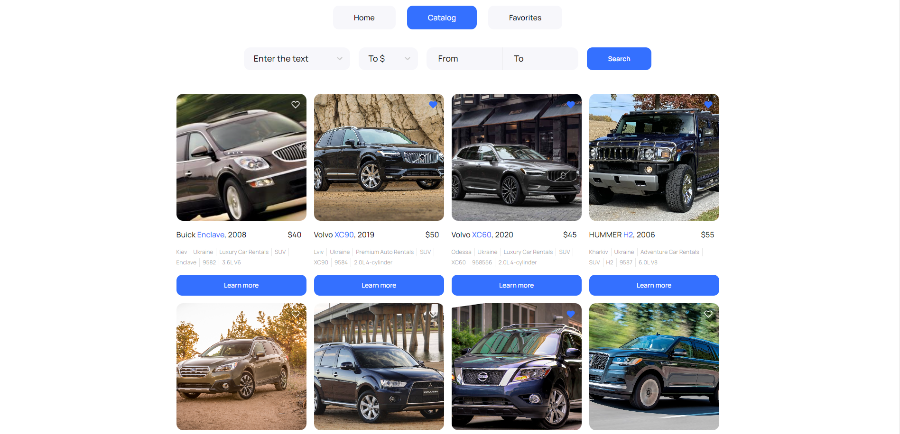
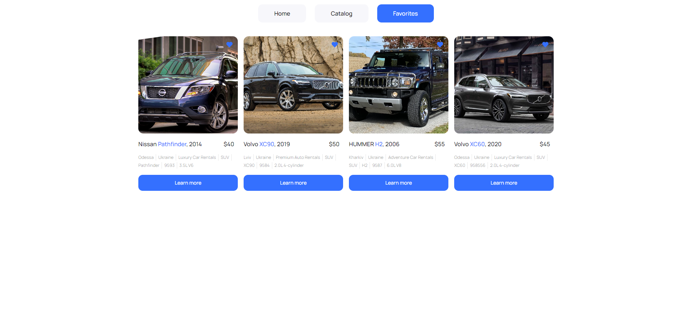

# Орендуй авто безпечно з  `RentalCar`

Прокат автомобілів "RentalCar" - це онлайн-платформа, яка надає можливість клієнтам знайти і забронювати автомобіль для подорожі або події. Наш сервіс пропонує широкий вибір автомобілів різних класів за доступними цінами.

## Основні функції:

- Перегляд доступних автомобілів за різними критеріями.

- Бронювання автомобіля онлайн.

- Зберігання улюблених автомобілів.

## Технології:

- HTML/CSS.

- JavaScript.

- React.

- Redux.

- Axios.

- mockApi.
  
## Встановлення та запуск

- Клонувати репозиторій: git clone https://github.com/yourusername/CarRental.git
  
- Встановити залежності: npm install
  
- Запустити сервер: npm start

- Відкрити веб-браузер і перейти за адресою: http://localhost:3000/

### [Посилання](<https://chapelk1.github.io/car-rent-ua/>) на робочий приклад проекту.

### Внесок у проект:

- Ви можете внести свій внесок у розвиток проекту, відкривши питання або запропонувавши покращення через систему Issues та Pull Requests на GitHub.
- Для зв'язку з розробниками надсилайте листи на адресу klepach154789@gmail.com
- 
### Скріншоти

### Автор 
Анатолій Клепач - klepach154789@gmail.com
